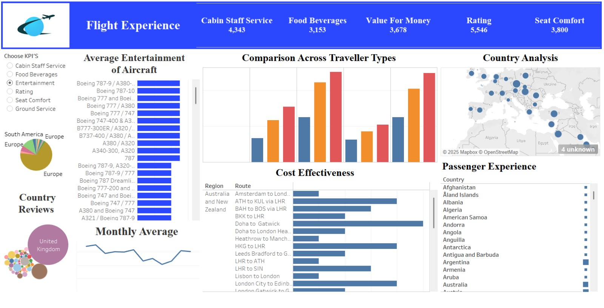

✈️ Aircraft Flight Experience Dashboard (Tableau)

📌 Project Overview

The **Aircraft Flight Experience Dashboard** is a data visualization project developed using **Tableau** to analyze passenger feedback and overall flight experience across different aircraft types, traveler categories, routes, and countries. The dashboard provides interactive insights into key service parameters that influence customer satisfaction in the aviation industry.

🎯 Project Objectives

* To analyze passenger experience across multiple airlines and aircraft models
* To compare service quality across different traveler types
* To identify cost-effective routes and performance trends
* To visualize country-wise and monthly passenger feedback

📊 Key KPIs Analyzed

* Cabin Staff Service
* Food & Beverages
* Seat Comfort
* Entertainment
* Overall Rating
* Value for Money

📈 Dashboard Features

* **Aircraft-wise Entertainment Analysis**
* **Traveler Type Comparison** (Business, Economy, etc.)
* **Country-wise Passenger Experience Map**
* **Route-based Cost Effectiveness Analysis**
* **Monthly Average Performance Trends**
* **Interactive KPI Selection Filters**

🌍 Insights Provided

* Identifies top-performing aircraft models based on passenger reviews
* Highlights service gaps across regions and traveler categories
* Helps airlines improve customer satisfaction using data-driven insights
* Supports strategic decision-making for cost and service optimization

🛠 Tools & Technologies Used

* **Data Visualization Tool:** Tableau
* **Data Type:** Passenger reviews & flight experience data
* **Techniques:** KPI Analysis, Filters, Comparative Analysis, Geographic Mapping

🚀 Use Cases

* Airline performance analysis
* Customer experience improvement
* Aviation market research
* Business intelligence reporting

📷 Dashboard Preview

👩‍💻 Developed By

Miss. Akanksha Kapratwar

  
